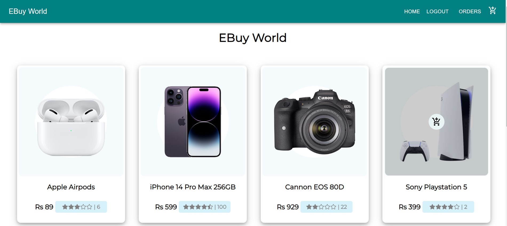
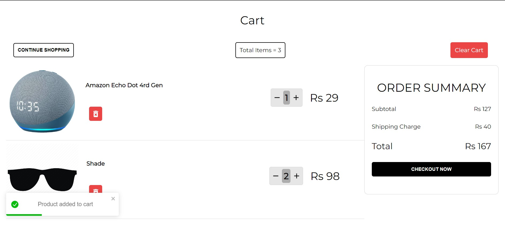
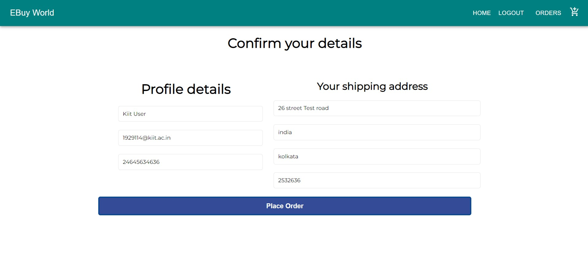
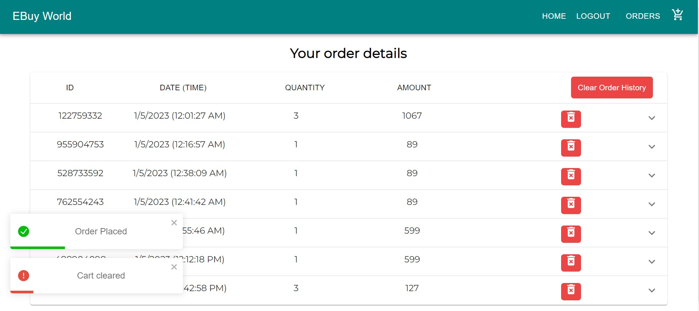
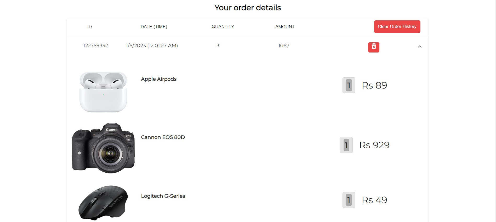
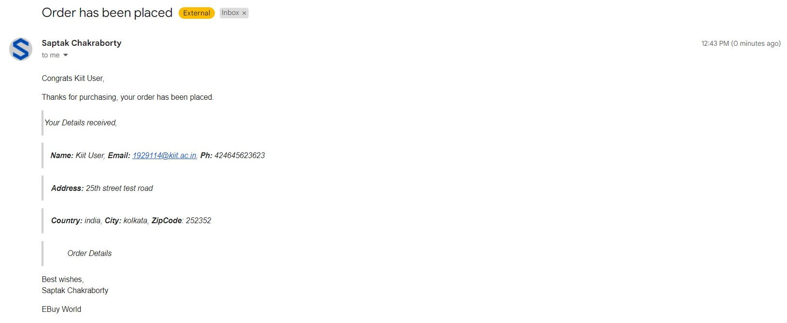
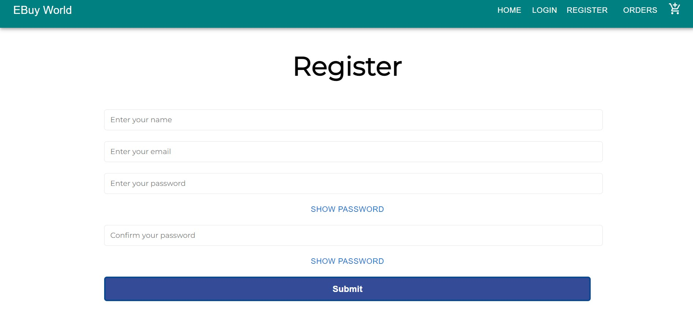
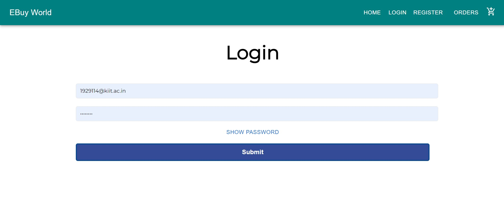

# HighWay-Delite-Assignment

## Details

Name - An Ecommerce Application

## Tasks

- List at least 10 items that are available for purchase.
- Can add, remove, change quantity of items in the cart.
- User must login to place the order.
- Items in the cart must be persisted across login.
- Should receive an email with relevant order information when order placed.
- An option to see the past orders.

## To run the application

### Frontend

#### (In the terminal)
- cd client
- Type `npm install` command in /client directory

### Backend

- Install nodejs version 14.17.0

#### (In the terminal)
- Type `npm install` command in root directory

#### Finally (In the terminal) Type `npm run dev` command in root directory

## Frontend Port - 3000

Server (http://localhost:3000/)

- Technologies used are <b>Reactjs, Material UI, Redux ToolKit, Axios, CSS, react-toastify, styled-components.</b>
- The home page displays all the products,
- Items can be added, modified and removed from the cart,
- Redux Toolkit is used for global state management
- React router dom to manage the routing
- various react hooks like useState(for state update), useEffect(for data rendering) is used
- various redux hooks like useSelector(to get the global state of the data), useDispatch(to dispatch the actions to the global reducers)
- react-toastify is used to give good UI alert messages on performing certain actions.
- Axios is used for API calling from backend server
- styled-components is used for a fluid css styling
- material ui and its icons are used to build the UI framework and the styling of the pages
- order page is made to see the order history
- user receives a mail after placing the order and can see his order details in the order page
- date and time is shown of the placed order
- emailjs is used for mail sending
- user can remove past orders

## Backend Port - 5000

Server (http://localhost:5000/)

- Technologies used are <b>Expressjs, Nodejs, Postman(for Api testing), bcryptjs, concurrently, cors, dotenv, jsonwebtoken, MongoDB.</b>
- The products api displays all the products in /products route
- Login Authentication is implemented along with user registration
- along with authorisation is implemented using json web token for session storage
- MVC architecture is followed in the backend
- root file server.js is the root of the application
- cors is used for cross site connection
- bcryptjs is used to generate salt and hash the password for extra security
- MongoDb database is used to store the data using mongoose
- Postman is used for all the API testing
- concurrently is used to run the backend and the frontend server simultaneously

UI Screenshots

